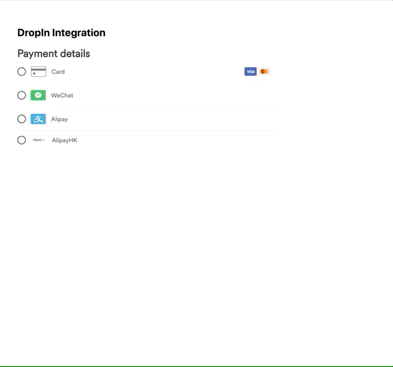

# Airwallex Payment Elements - Drop-in Element Integration

The Drop-in element allows merchants to embed a card element checkout option on their website. This element gives merchant control over the overall look and feel of their checkout page, while delegating the responsibility of payment processing to Airwallex. It gives customers different payment options.



\* _An example of a Drop-in element._

## Guide

The following steps demonstrates the best practices to integrating with our payment platform. Code is in Javascript.

Want more details? See the integration in [React](/integrations/react/src/components/Dropin.jsx).

### 1. At the start of your file, import `airwallex-payment-elements`.

```js
import Airwallex from 'airwallex-payment-elements';
```

or add the bundle as a script in your HTML head

```html
<script src="https://checkout.airwallex.com/assets/elements.bundle.min.js"></script>
```

Be sure to replace the x.x.x with the `airwallex-payment-elements` package version you'd like to use.

### 2. Initialize the Airwallex package with the appropriate environment

```js
Airwallex.loadAirwallex({
  env: 'demo', // Setup which Airwallex env('staging' | 'demo' | 'prod') to integrate with
  origin: window.location.origin, // Setup your event target to receive the browser events message
});
```

`loadAirwallex` takes in options to set up the payment environment. See docs for further customizations [here](/docs#loadAirwallex).

The Airwallex package only needs to be mounted once in an application (and everytime the application reloads).

### 3. Add an empty container for the card element to be injected into and a submit button to trigger the payment request

```html
<div id="drop-in"></div>
```

We will mount the card element into the empty div in step 5.

### 4. Create the dropIn element

This creates the specified [Element](/docs#Element) object. We specify the type as **`dropIn`**.

```js
const element = Airwallex.createElement('dropIn', {
  intent_id: 'replace-with-your-intent-id',
  client_secret: 'replace-with-your-client-secret',
  currency: 'replace-with-your-intent-currency'
});
```

You **must provide intent details** to create the dropIn element.

There are also additional options as a second parameter to the `createElement` function that can overwrite styles and other functions. [See docs](/docs#createElement) for more details.

### 5. Mount the card element

Next, we need to mount the card element to the DOM.

```js
element.mount('drop-in');
```

This function will append the card element to your div with an id `drop-in` as created in step 3. **Ensure that there are no other elements in the document with the same id**.

The **element should only be mounted once** in a single payment flow.

### 6. Add an `onReady` event listener to handle events when the element is mounted

```js
window.addEventListener('onReady', (event) => {
  /*
    ... Handle event
  */
  window.alert(event.detail);
});
```

This can be used to set a loading state as the checkout screen is being prepared.

### 7. Add an `onSuccess` event listener to handle events when the payment is successful.

```js
window.addEventListener('onSuccess', (event) => {
  /*
    ... Handle event on success
  */
  window.alert(event.detail);
});
```

### 8. Add an `onError` event listener to handle events when the payment has failed.

```js
window.addEventListener('onError', (event) => {
  /*
    ... Handle event on error
  */
  window.alert(event.detail);
});
```

### 9. Beautify and deploy!

## Documentation

See the full documentation for `airwallex-payment-elements` [here](/docs).

## Integration Examples

Check out [airwallex-payment-demo](/../../tree/master) for integration examples with different web frameworks!

## Full Code Example

```html
<!DOCTYPE html>
<html>
  <head lang="en">
    <meta charset="utf-8" />
    <meta name="viewport" content="width=device-width, initial-scale=1" />
    <title>Airwallex Checkout Playground</title>
    <!-- STEP #1: Import airwallex-payment-elements bundle -->
    <script src="https://checkout.airwallex.com/assets/elements.bundle.min.js"></script>
  </head>
  <body>
    <h1>DropIn integration</h1>
    <!-- STEP #3: Add an empty container for the dropIn element to be injected into -->
    <div id="dropIn"></div>
    <script>
      // STEP #2: Initialize the Airwallex global context for event communication
      Airwallex.init({
        env: 'staging', // Setup which Airwallex env('staging' | 'demo' | 'prod') to integrate with
        origin: window.location.origin, // Setup your event target to receive the browser events message
      });
      // STEP #4: Create 'dropIn' element
      const dropIn = Airwallex.createElement('dropIn', {
        intent: {
          // Required, dropIn use intent Id and client_secret to prepare checkout
          id: 'replace-with-your-intent-id',
          client_secret: 'replace-with-your-client-secret',
        },
      });
      // STEP #5: Mount 'dropIn' element
      dropIn.mount('dropIn');

      // STEP #6: Add an event listener to handle events when the element is mounted
      window.addEventListener('onReady', (event) => {
        /*
          ... Handle event
        */
        window.alert(event.detail);
      });

      // STEP #7: Add an event listener to handle events when the payment is successful.
      window.addEventListener('onSuccess', (event) => {
        /*
          ... Handle event on success
        */
        window.alert(event.detail);
      });

      // STEP #8: Add an event listener to handle events when the payment has failed.
      window.addEventListener('onError', (event) => {
        /*
          ... Handle event on error
        */
        console.log(event.detail);
      });
    </script>
  </body>
</html>
```
