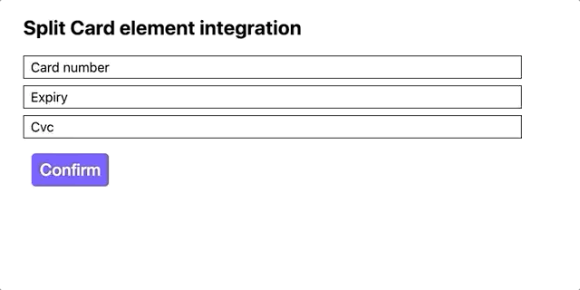

# Recurring flow

The Recurring flow enables shopper to create and save their CIT(customer initial transaction) and MIT(merchant initial transaction) payment consent which could be use to payment in the future transaction. 

### Create payment consent 
This create consent flow could be achieved by Card element or Split card element. We could either simply create a consent or create a consent while confirm an intent with this consent.

### Confirm payment using consent
For MIT subsequent transaction, merchant just need to call confirm API to finish payment.
For CIT subsequent transaction, merchant need query and list available consents and render cvc element to let shopper choose consent and input cvc number to finish transaction. 


\* _An example of a split card integration. Can be customized._


\* _An example of a card element. Can be customized._

## Guide for `Create payment consent`

The following steps demonstrates the best practices to integrating with our payment platform. Code is in Javascript.

Want more details? See the integration in [React](/integrations/react/src/components/SplitCard.jsx).

### 1. Follow the split card element / card element integration document step 1-5

You can choose the split card element or card element to setup the recurring flow. Follow the steps 1-5 in the integration doc.

[Split card element integration guide](https://github.com/airwallex/airwallex-payment-demo/blob/master/docs/splitcard.md#guide)

[Card element integration guide](https://github.com/airwallex/airwallex-payment-demo/blob/master/docs/card.md#guide)
 
### 2. Add a button handler to trigger the recurring request and listen to the request response.

This handler is called when a customer is ready to create a consent along with the necessary payload according to your requirement.

```js
// STEP #6a: Add a button handler
document.getElementById('submit').addEventListener('click', () => {
  Airwallex.createPaymentConsent({
    intent_id: 'replace-with-your-intent-id', // intent id(Optional)
    customer_id: 'replace-with-your-customer-id', // customer id
    client_secret: 'replace-with-your-client-secret', // client secret
    currency: 'replace-with-your-currency', // currency
    element: cardElement // either the card element or card number element depends on the element you integrate,
    next_triggered_by: 'customer' // 'merchant' for MIT and 'customer' for CIT
  }).then((response) => {
    // STEP #6b: Listen to the request response
    /* Handle response */
    window.alert(JSON.stringify(response));
  });
});
```

`Airwallex.createPaymentConsent` will take the cardNumber element or card element you mounted and create payment consent.

More details about the `createPaymentConsent` function can be found [here](/docs#createPaymentConsent).

### 3. Follow the split card element / card element integration document step 7-9

[Split card element integration guide](https://github.com/airwallex/airwallex-payment-demo/blob/master/docs/splitcard.md#guide)

[Card element integration guide](https://github.com/airwallex/airwallex-payment-demo/blob/master/docs/card.md#guide)


## Guide for `Confirm payment using consent` with MIT flow
For MIT consent, merchant could trigger the payment without shopper, so merchant could use the `confirmPaymentIntent` function to complete the transaction. [confirmPaymentIntent detail](https://github.com/airwallex/airwallex-payment-demo/tree/master/docs#confirmpaymentintent)

## Guide for `Confirm payment using consent` with CIT flow
For CIT consent, shopper will trigger a transaction and enter cvc number to finish the payment. So merchant need to integrate with cvc element.

### 1. At the start of your file, import `airwallex-payment-elements`.

```js
import Airwallex from 'airwallex-payment-elements';
```

or add the bundle as a script in your HTML head

```html
<script src="https://checkout.airwallex.com/assets/bundle.x.x.x.min.js"></script>
```

Be sure to replace the x.x.x with the `airwallex-payment-elements` package version you'd like to use.

### 2. Initialize the Airwallex package with the appropriate environment

```js
Airwallex.loadAirwallex({
  env: 'demo', // Setup which Airwallex env('staging' | 'demo' | 'prod') to integrate with
  origin: window.location.origin, // Setup your event target to receive the browser events message
});
```

`loadAirwallex` takes in options to set up the payment environment. See docs for further customizations [here](/docs#loadAirwallex).

The Airwallex package only needs to be mounted once in an application (and everytime the application reloads).

### 3. Add empty containers for cvc element to be injected into and a submit button to trigger the payment request

```html
<label>
  CVC
  <div id="cvc"></div>
</label>
<br />
<button id="submit">Submit</button>
```

We will mount the cvc elements into the empty divs in step 5 and create a handler for the submit button in step 6.

### 4. Create the split cvc elements

This creates the specified [Element](/docs#Element) objects. We specify the types as `cvc`.

```js
const cvc = Airwallex.createElement('cvc');
```

There are also additional options as a second parameter to the `createElement` function that can overwrite styles and other functions. [See docs](/docs#createElement) for more details.

### 5. Mount the cvc elements

Next, we need to mount the cvc element to the DOM.

```js
cvc.mount('cvc');
```

This function will append the cvc element to your divs with ids `cvc`, as created above in step 3. **Ensure that there are no other elements in the document with the same ids**.

Each **cvc element should only be mounted once** in a single payment flow.

### 6. Add a button handler to trigger the payment request and listen to the request response.

This handler is called when a customer is ready to make a payment according to the details documented in the Payment Intent, thereby confirming the Payment Intent.

```js
// STEP #6a: Add a button handler
document.getElementById('submit').addEventListener('click', () => {
  Airwallex.confirmPaymentIntent({
    element: cvc, // Provide the cvc element
    id: 'replace-with-your-intent-id', // Payment Intent ID
    client_secret: 'replace-with-your-client-secret', // Client Secret
    payment_consent_id: 'replace-with-your-consent-id' // Payment Consent id,
  }).then((response) => {
    // STEP #6b: Listen to the request response
    /* Handle response */
    window.alert(JSON.stringify(response));
  });
});
```

`Airwallex.confirmPaymentIntent` will take the cvc element you mounted and confirm the payment details entered to the payment intent (provided by the `id` prop). A `client_secret` must be provided to authenticate the checkout process.

More details about the `confirmPaymentIntent` function can be found [here](/docs#confirmPaymentIntent).

### 7. Add an `onReady` event listener to handle events when the element is mounted

```js
window.addEventListener('onReady', (event) => {
  /*
    ... Handle event
  */
  window.alert(event.detail);
});
```

This can be used to set a loading state as the checkout screen is being prepared.

### 8. Add an `onChange` event listener to listen to the changes in each of the input fields

```js
window.addEventListener('onChange', (event) => {
  /*
    ... Handle event
  */
  window.alert(event.detail);
});
```

`event` will return an object with the field name and whether this field is completed (valid). This can help with validating the fields before users can trigger the submit button to prevent any validation errors.

### 9. Beautify and deploy!
